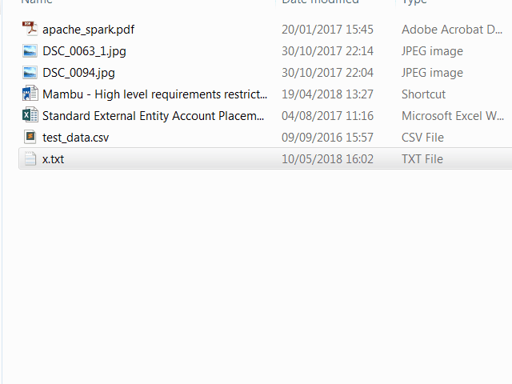

Short list of tools I use on Windows
# [Seer](http://1218.io/seer/screenshot.html)
is a Windows quick look tool.
* Acts just like the one in macOS, but Seer is more powerful, customizable and faster.
* In explorer just press <kbd>space</kbd> and preview archives, pictures, Excel tables, Word documents, text files, etc.
* New version are paid $ :(

<p align="left">

</p>


[exe](https://sourceforge.net/projects/ccseer/files/latest/download)
# [Cmder](http://cmder.net/) 
is a pre-configured software package providing you the best terminal emulator.
* Has multiple tabs, support multiple environments (Git for Bash, Bash, Mintty, PowerShell, ... ) But also others could be added (Baboon)
* Works on the top of console emulator [ConEmu](https://conemu.github.io/), adds [Clink] (https://mridgers.github.io/clink/)
* Comes with necessary UNIX tools like find, grep, ssh, git, ...
* Allows color scheme customization
* Third-party integration like splitting the pane with your favourite editor 

[full installer](https://github.com/cmderdev/cmder/releases/download/v1.3.5/cmder.zip)
[mini installer](https://github.com/cmderdev/cmder/releases/download/v1.3.5/cmder_mini.zip)
# [Q-Dir](http://softwareok.com/?seite=Freeware/Q-Dir)
lets you work with 4 different Explorer windows inside one application.
* You can save your favourite locations and refresh them anytime
* Maximizes your productivity when you need to check files in multiple directories in the same time.

[exe portable](https://www.softwareok.com/?Download=Q-Dir&goto=../Download/Q-Dir_Portable_x64.zip)
[exe installer](https://www.softwareok.com/?Download=Q-Dir&goto=../Download/Q-Dir_Installer_x64.zip)
# [Fuzzy Finder](https://github.com/junegunn/fzf)
is an interactive Unix filter for command-line that can be used with any list; files, command history, processes, hostnames, bookmarks, git commits, etc.
* Great for variety of tasks - history search (ctrl+r), git aliases, searching for a file, you name it.

[exe-386](https://github.com/junegunn/fzf-bin/releases/download/0.17.3/fzf-0.17.3-windows_386.zip)
[exe-amd]( https://github.com/junegunn/fzf-bin/releases/download/0.17.3/fzf-0.17.3-windows_amd64.zip)
# [Process Explorer](https://docs.microsoft.com/en-us/sysinternals/downloads/process-explorer)
shows you information about which handles and DLLs processes have opened or loaded.
* Ever wondered which program has a particular file or directory open? Now you can find out. 
* Memory, CPU consumption
* CPU Affinity
* Parameters used at program startup
* Process tree
# [CSVed](http://csved.sjfrancke.nl/index.html)
basic spreadsheet file editor that supports the CSV file format. You can:
* add/delete columns, rearrange column order, change separator, 
* filter items
* remove duplicates
* split/join columns etc

[exe](http://home.hccnet.nl/s.j.francke/csved/CSVed.zip) 
[installer](http://home.hccnet.nl/s.j.francke/csved/csvedsetup.exe)
# [DiffMerge](https://sourcegear.com/diffmerge/)
graphically shows the changes between two files. Includes intra-line highlighting and full support for editing.
* shows diff
* helps with merge
* diff directories

[exe](https://download.sysinternals.com/files/ProcessExplorer.zip)

# [Sublime Text 3](https://download.sysinternals.com/files/ProcessExplorer.zip)
is one of the top-notch text editors
* Very versatile
* Lightweight
* Supports multiple prompts at the same time
* Countless add-ons (one for all [Package Control](https://packagecontrol.io/) )
[More to see here](docs/sublime.md)

[exe portable](https://download.sublimetext.com/Sublime%20Text%20Build%203170%20x64.zip)

# [Screen2GIF](http://www.screentogif.com/)
make short animations of your screen
- requires .NET framework
[exe](http://www.screentogif.com/)

# [1Clipboard](http://1clipboard.io/)
share clipboard even among multiple computers in different locations or 
#Windows# #MacOS#
* uses Google Drive (keep security in mind)
[Win exe installer](http://1clipboard.io/download/windows/1ClipboardSetup.exe)
[Mac OS installer](http://1clipboard.io/download/darwin/1Clipboard.dmg)
# [Winclip](http://dmst.aueb.gr/dds/sw/outwit/winclip.html)
works with clipboard from commandline
similar way as Mac OS works with `pbcopy` and `pbpaste`
* `echo "hello" | winclip -c` 
* `winclip -p`
I do recommend to use aliases like `pbcopy`/`pbpaste` or `clipc`/`clipp` or detect if the stdin is connectected and use one `clip` for both based on that information
[zip](http://dmst.aueb.gr/dds/sw/outwit/outwit-bin-1.25.zip)
# [Youtube DL](http://rg3.github.io/youtube-dl/download.html)
Downloads youtube video as `.mp4`
* `youtube-dl.exe https://www.youtube.com/watch?v=XYZO1234ABCDE`
# [Snipaste](https://www.snipaste.com/)
Powerful screenshot tool
[exe](https://dl.snipaste.com/win-x64)

# System commands
## clip
standard Windows command
* `DIR | CLIP` Places a copy of the current directory listing into the Windows clipboard. 
* `CLIP < README.TXT` Places a copy of the text from readme.txt on to the Windows clipboard.
# Chrome extensions
## [Shortcuts (Custom Keyboard Shortcuts](https://chrome.google.com/webstore/detail/shortkeys-custom-keyboard/logpjaacgmcbpdkdchjiaagddngobkck?utm_source=chrome-app-launcher-info-dialog)
customize shortcuts you are used to. I was used to Mac so the following are good fit for me:
* <kbd>ctrl</kbd>+<kbd>alt</kbd>+<kbd>left</kbd> Previous tab - instead of clumsy <kbd>Ctr</kbd>+<kbd>Shift</kbd>+<kbd>Tab</kbd>
* <kbd>ctrl</kbd>+<kbd>alt</kbd>+<kbd>right</kbd> Next tab - instead of clumsy <kbd>Ctr</kbd>+<kbd>Tab</kbd>
* <kbd>backspace</kbd> Go back - like in Internet Explorer
* <kbd>alt</kbd>+<kbd>left</kbd> Stop back (???)
```json
[{"action":"prevtab","blacklist":false,"exported":true,"key":"ctrl+alt+left","open":false,"sites":"*mail.google.com*","sitesArray":["*mail.google.com*"]},{"action":"nexttab","blacklist":false,"exported":true,"key":"ctrl+alt+right","open":false,"sites":"*mail.google.com*","sitesArray":["*mail.google.com*"]},{"action":"back","blacklist":false,"exported":true,"key":"backspace","open":false,"sites":"*mail.google.com*","sitesArray":["*mail.google.com*"]},{"action":"disable","activeInInputs":true,"blacklist":false,"customName":"stop back","exported":true,"key":"alt+left","open":false,"sites":"*mail.google.com*","sitesArray":["*mail.google.com*"]}]
```
## [Swype Gesture](https://chrome.google.com/webstore/detail/swipe-gesture/mgegfjnccpnkdppohmfgnjalkediapkc?utm_source=chrome-app-launcher-info-dialog)
adds two finger gesture customization
I use it for common Mac gesture:
* 2 fingers left swipe - go backwards
* 2 fingers right swipe - go forward

## [Switch Recent Tabs](https://chrome.google.com/webstore/detail/switch-recent-tabs/odhjcgnlbagjllfbilicalpigimhdcll?utm_source=chrome-app-launcher-info-dialog)

* toggles two recent active tabs <kbd>Alt</kbd> + <kbd>Q</kbd> - similar to <kbd>Option</kbd><kbd>\`</kbd> on Mac
* toggles two recent active windows (or apps as browser - Slack for example) <kbd>Alt</kbd> + <kbd>\`</kbd> - same as <kbd>Option</kbd><kbd>`</kbd> on Mac
* reopens recent closed tab/window <kbd>Ctr</kbd>+<kbd>Shift</kbd>+<kbd>T</kbd>

# Chrome bookmarklets
basically Javascript code run as bookmark
## prefill Zendesk request
like request to install software
```javascript
javascript:(function(){ document.getElementById("request_custom_fields_22718993").value="czech_republic"; document.getElementById("request_custom_fields_29168837").value="of_it"; document.getElementById("request_custom_fields_20963211").value="helpdesk_1"; document.getElementById("request_collaborators_").value="ilya.tarasyuk@4finance.com";}  () )
```
